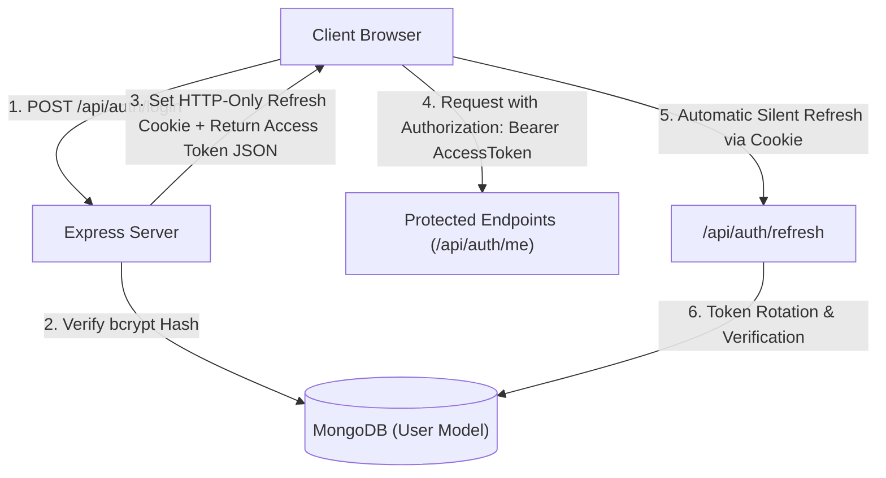
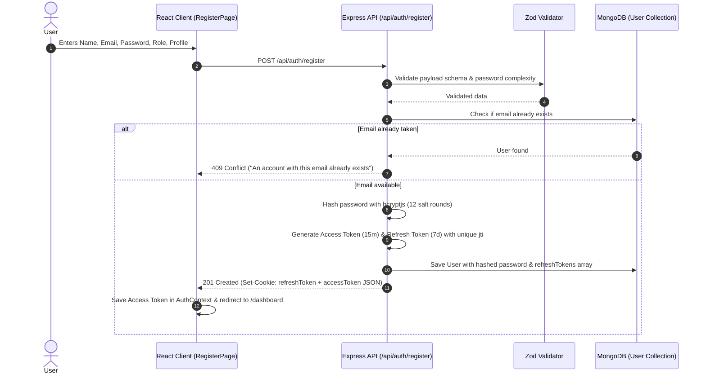
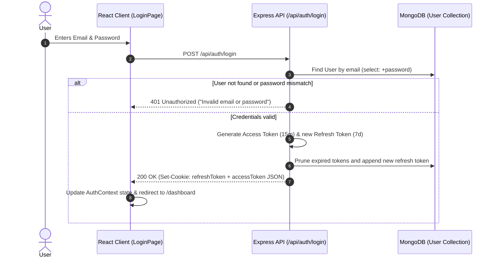
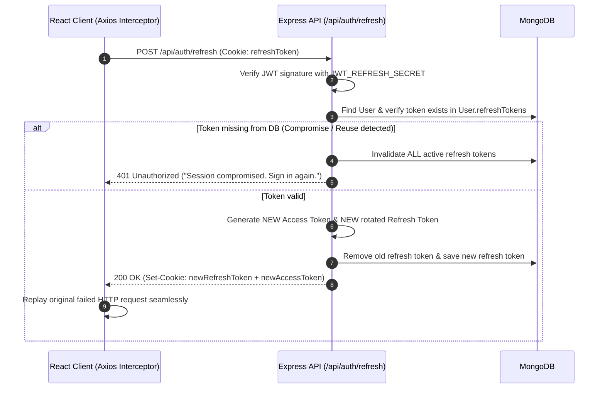
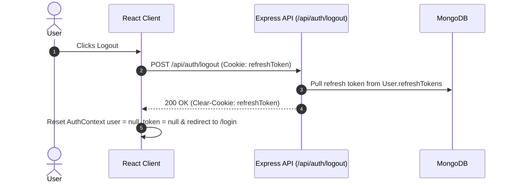

# CampusFlow Architecture Specification

## 1. System Overview

CampusFlow is designed using the **MERN** (MongoDB, Express, React, Node.js) technology stack, structured inside an **npm workspaces monorepo**. This ensures isolated package dependencies, shared tooling, and modular scalability without leaking domain concerns across layers.

---

## 2. Authentication & Authorization Architecture (Level 1)

### 2.1 Security & Token Architecture



### 2.2 Registration Flow



### 2.3 Login Flow



### 2.4 Silent Refresh & Token Rotation Flow



### 2.5 Logout Flow



---

## 3. Database Schema: User Model

```
User Schema {
  name: String (required, trim, min: 2, max: 50)
  email: String (required, unique, lowercase, trim, indexed)
  password: String (required, select: false, bcrypt hashed)
  role: Enum ['student', 'faculty', 'admin'] (default: 'student', indexed)
  profile: {
    avatar: String
    bio: String (max: 250)
    department: String
    graduationYear: Number
    collegeId: String
  }
  refreshTokens: [
    {
      token: String (required)
      expiresAt: Date (required)
      createdAt: Date (default: Date.now)
    }
  ]
  createdAt: Date (timestamp)
  updatedAt: Date (timestamp)
}
```

---

## 4. Key Security Decisions

1. **XSS Mitigation**: Long-lived refresh tokens are stored exclusively in `httpOnly`, `secure`, `sameSite: 'lax'` cookies, preventing malicious client scripts from reading them.
2. **Access Token Lifespan**: Short-lived (15 minutes) in-memory tokens minimize the risk window if intercepted.
3. **Token Rotation & Revocation**: Refresh tokens are single-use. Replay detection automatically invalidates all active sessions for that account.
4. **Bcrypt Hashing**: Passwords undergo 12 rounds of salted bcrypt hashing.
5. **Role-Based Guards**: Protected endpoints and client routes check permissions before serving data or views.
