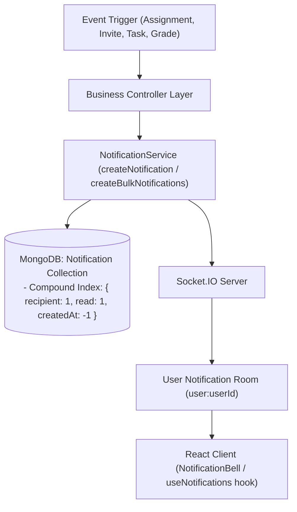
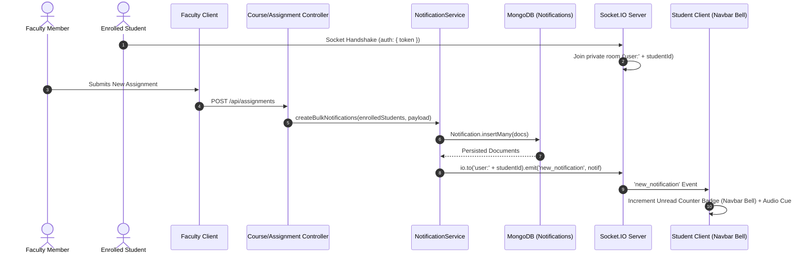
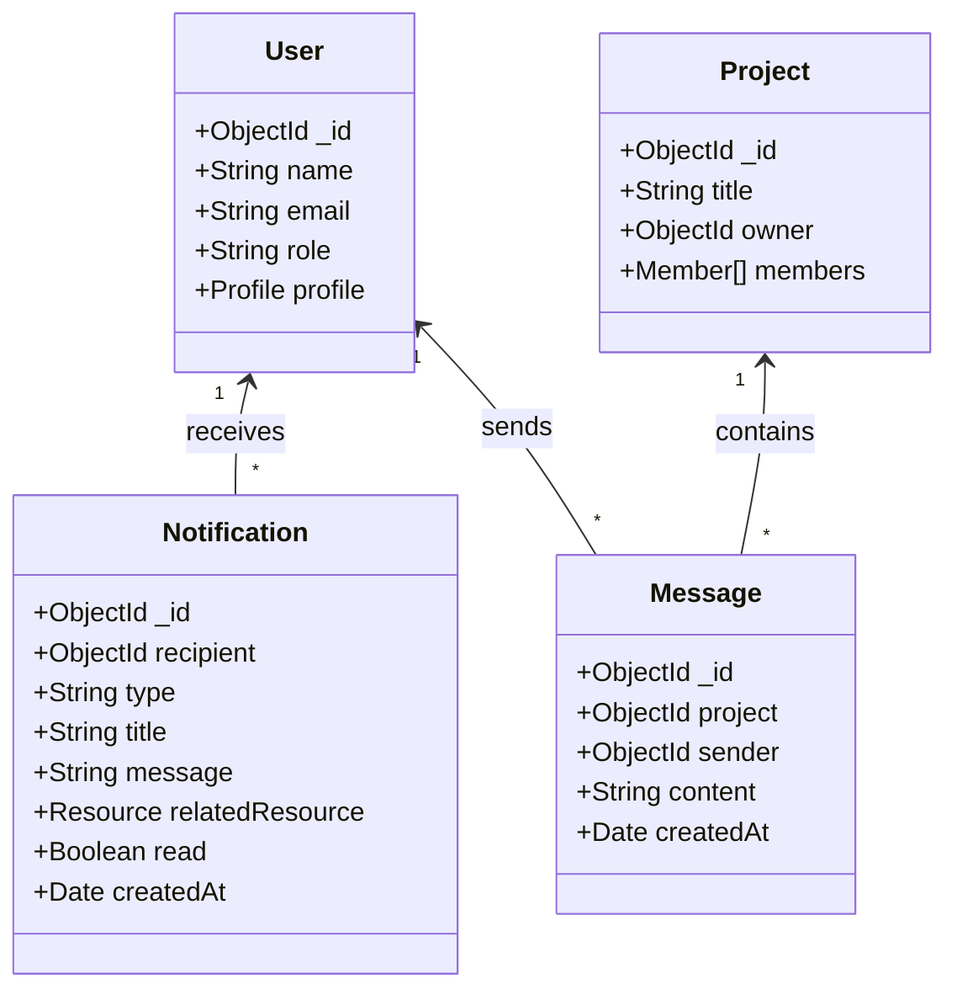

# CampusFlow Architecture Specification

## 1. System Overview

CampusFlow is designed using the **MERN** (MongoDB, Express, React, Node.js) technology stack, structured inside an **npm workspaces monorepo**. This ensures isolated package dependencies, shared tooling, and modular scalability without leaking domain concerns across layers.

---

## 2. Centralized Notification Architecture (Level 7)

---

## 3. Real-Time Notification Event Lifecycle

---

## 4. REST vs WebSocket Responsibilities

| Responsibility Layer | Transport Protocol | Primary Role |
|---|---|---|
| **Notification Hydration & History** | **HTTP / REST** (`GET /api/notifications`) | Cold start state hydration, unread counts (`/unread-count`), pagination. |
| **Notification Status Mutations** | **HTTP / REST** (`PATCH /:id/read`, `PATCH /read-all`) | Atomic status updates to database with immediate cache mutation. |
| **Real-time Live Sync** | **WebSockets (Socket.IO)** | Instant delivery of notifications directly to the targeted `user:<userId>` room. |
| **Message Streaming (Chat)** | **WebSockets (Socket.IO)** | Delivers instant chat messages, typing indicators, and online presence in `project:<projectId>`. |
| **Authentication** | **Handshake JWT** | Verifies token during socket handshake; automatically joins socket to `user:<userId>`. |
| **Durability Guarantee** | **MongoDB (`Notification` collection)** | Notifications are persisted to MongoDB before broadcasting, ensuring no missed alerts. |

---

## 5. Data Models & Performance Indexes

### Database Performance Indexes:
| Collection | Index Fields | Type | Purpose |
|---|---|---|---|
| `notifications` | `{ recipient: 1, read: 1, createdAt: -1 }` | Compound | Fast unread count aggregation & chronological queries |
| `messages` | `{ project: 1, createdAt: 1 }` | Compound | Fast chronological chat history retrieval |
| `projects` | `{ "members.user": 1 }` | Multikey | Fast retrieval of user's active projects |
| `tasks` | `{ project: 1, status: 1, order: 1 }` | Compound | Instant Kanban board column rendering |
| `assignments` | `{ course: 1, status: 1, dueDate: 1 }` | Compound | Fast course deliverables queries |
