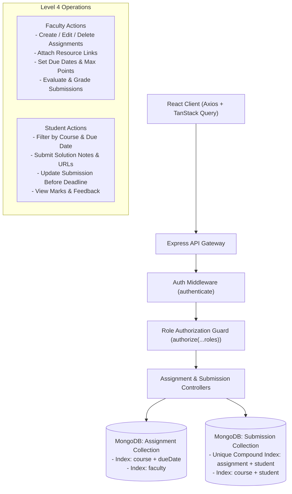
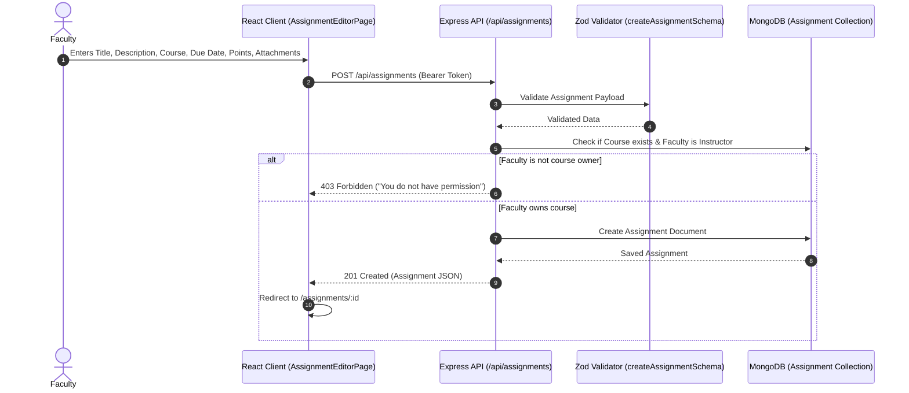
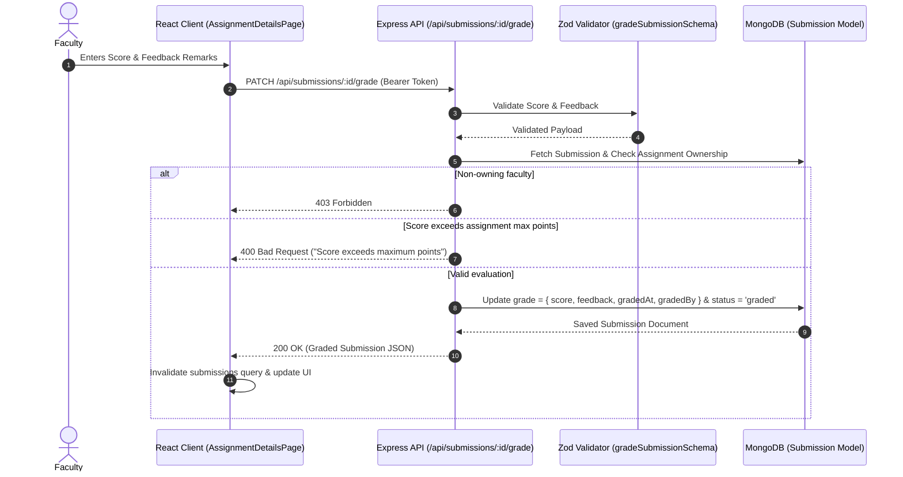
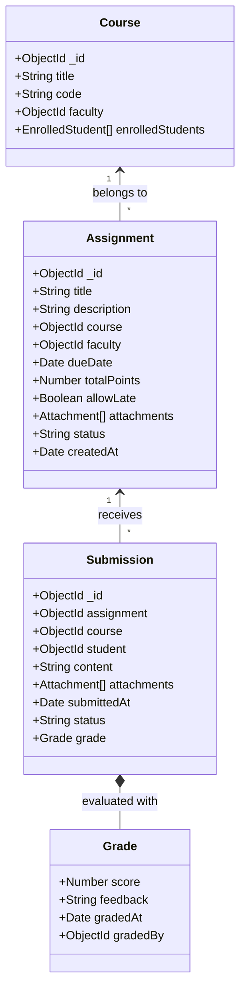

# CampusFlow Architecture Specification

## 1. System Overview

CampusFlow is designed using the **MERN** (MongoDB, Express, React, Node.js) technology stack, structured inside an **npm workspaces monorepo**. This ensures isolated package dependencies, shared tooling, and modular scalability without leaking domain concerns across layers.

---

## 2. Course & Assignment Architecture



---

## 3. Assignment Creation Flow



---

## 4. Student Submission Flow

```mermaid
sequenceDiagram
    autonumber
    actor Student
    participant Client as React Client (AssignmentDetailsPage)
    participant API as Express API (/api/assignments/:id/submit)
    participant Auth as JWT Auth Middleware
    participant DB as MongoDB (Submission Model)

    Student->>Client: Submits Solution Text, GitHub URL, and Attachments
    Client->>API: POST /api/assignments/:id/submit (Bearer Token)
    API->>Auth: Verify Token & Student Role
    Auth-->>API: Validated Student Session (req.user)
    API->>DB: Find Assignment & Check Course Enrollment
    alt Student is not enrolled in course
        API-->>Client: 403 Forbidden ("Must be enrolled in course")
    else Past deadline and allowLate is false
        API-->>Client: 400 Bad Request ("Deadline passed; late submissions not allowed")
    else Valid Submission (On-time or Late Allowed)
        Note over API,DB: Determine status ('submitted' or 'late')
        API->>DB: Upsert Submission Document for (assignment, student)
        DB-->>API: Saved Submission Record
        API-->>Client: 200 OK (Submission JSON with status)
        Client->>Client: Invalidate 'assignment' query & show confirmation
    end
```

---

## 5. Faculty Grading Flow



---

## 6. Data Model Relationships



---

## 7. Database Indexes & Performance Design

| Collection | Index Fields | Type | Purpose |
|---|---|---|---|
| `assignments` | `{ course: 1, dueDate: 1 }` | Compound | Fast retrieval of course assignments sorted by deadline |
| `assignments` | `{ faculty: 1 }` | Single Field | Instructor assignment management |
| `submissions` | `{ assignment: 1, student: 1 }` | Unique Compound | Strict guarantee of one submission per student per assignment |
| `submissions` | `{ course: 1, student: 1 }` | Compound | Rapid lookup of student submissions across a course |
| `submissions` | `{ student: 1 }` | Single Field | Student grades and submission history lookup |
