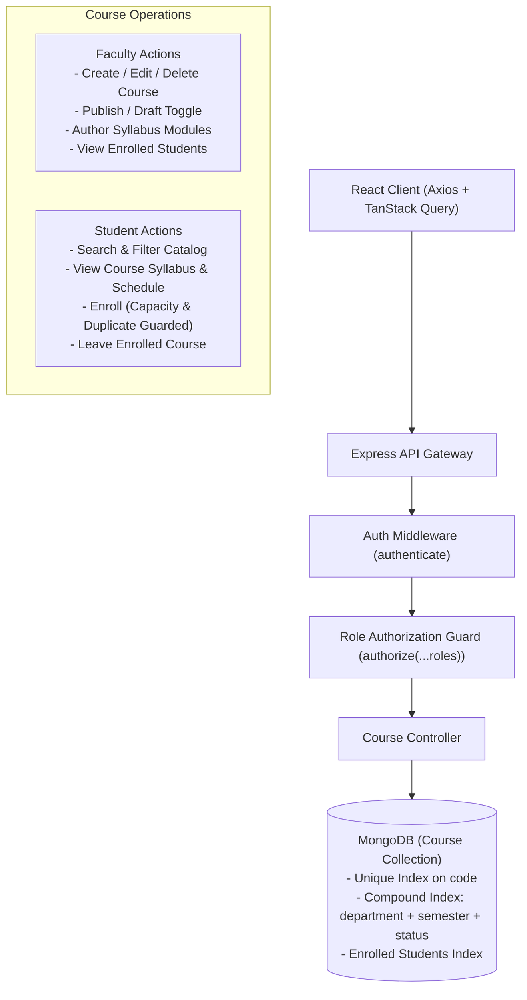
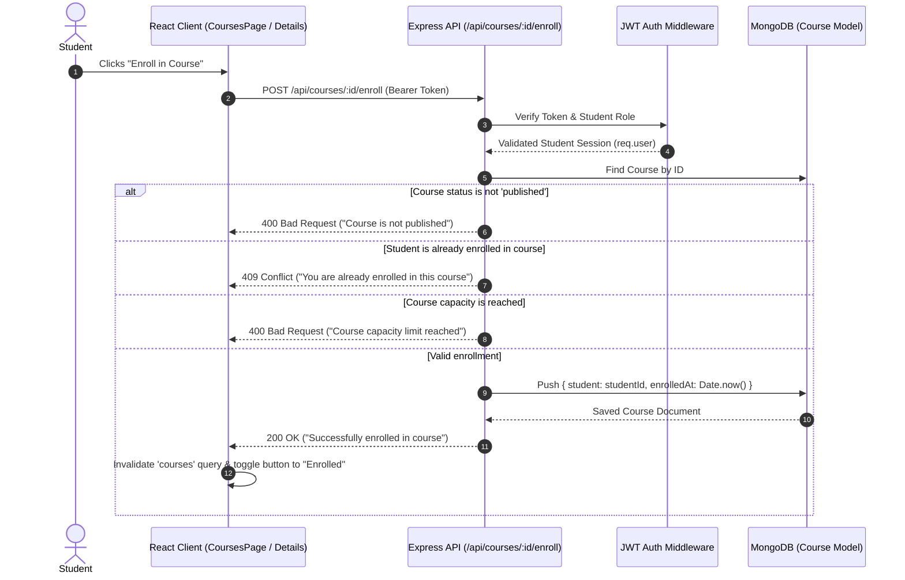
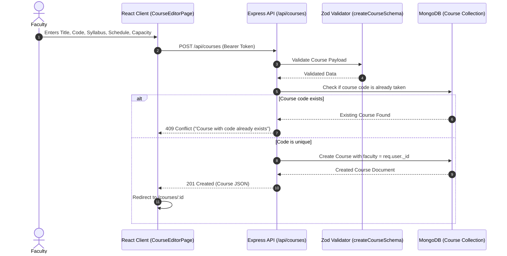
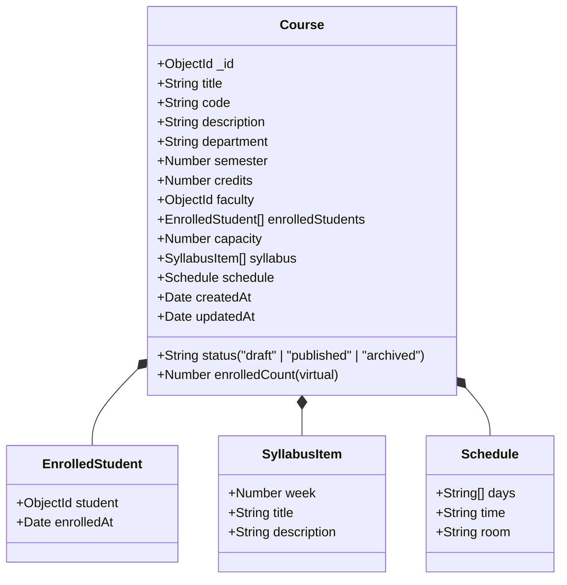

# CampusFlow Architecture Specification

## 1. System Overview

CampusFlow is designed using the **MERN** (MongoDB, Express, React, Node.js) technology stack, structured inside an **npm workspaces monorepo**. This ensures isolated package dependencies, shared tooling, and modular scalability without leaking domain concerns across layers.

---

## 2. Course Management Architecture (Level 3)

---

## 3. Student Enrollment Flow

---

## 4. Faculty Course Creation & Management Flow

---

## 5. Course Data Model

---

## 6. Database Indexes & Performance Design

| Collection | Index Fields | Type | Purpose |
|---|---|---|---|
| `courses` | `{ code: 1 }` | Unique | Enforces course code uniqueness (e.g. `CS101`) |
| `courses` | `{ faculty: 1 }` | Single Field | Fast lookup for instructor's created courses |
| `courses` | `{ department: 1, semester: 1, status: 1 }` | Compound | Fast student catalog filtering |
| `courses` | `{ "enrolledStudents.student": 1 }` | Multikey | Instant retrieval of a student's enrolled courses |
| `courses` | `{ title: "text", description: "text", code: "text" }` | Text Search | Full-text search across course catalog |
