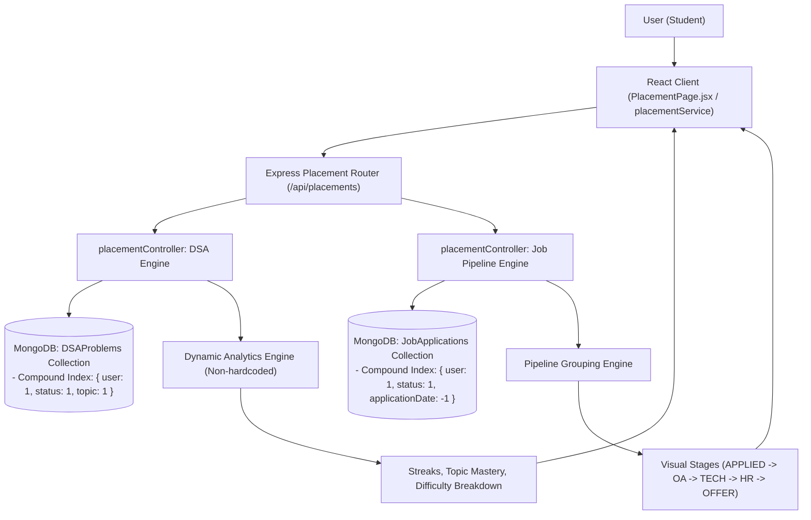
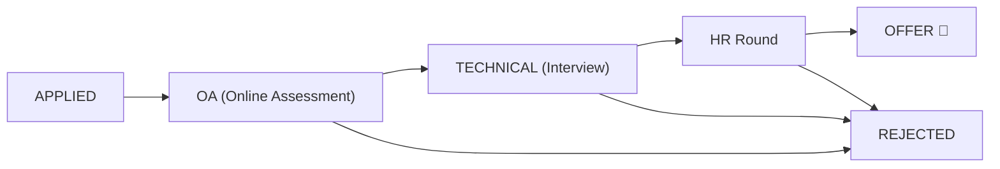
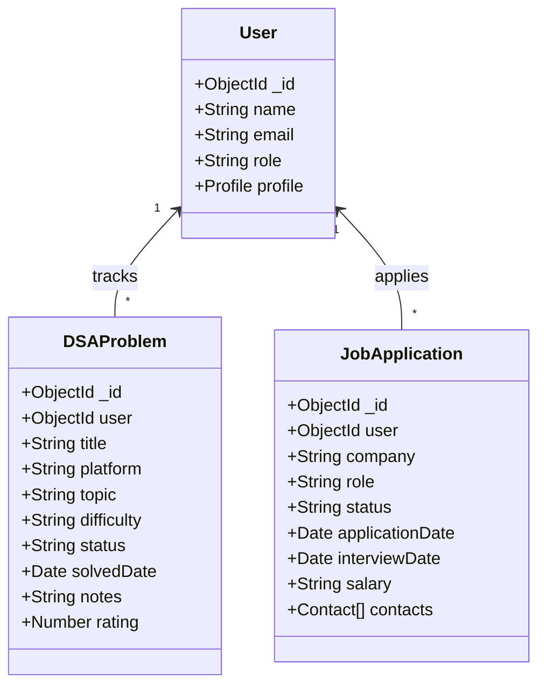

# CampusFlow Architecture Specification

## 1. System Overview

CampusFlow is designed using the **MERN** (MongoDB, Express, React, Node.js) technology stack, structured inside an **npm workspaces monorepo**. This ensures isolated package dependencies, shared tooling, and modular scalability without leaking domain concerns across layers.

---

## 2. Placement Preparation & Analytics Architecture (Level 8)

---

## 3. Job Application Pipeline Funnel

---

## 4. REST vs WebSocket Responsibilities

| Responsibility Layer | Transport Protocol | Primary Role |
|---|---|---|
| **Placement & Career Data** | **HTTP / REST** (`/api/placements/dsa`, `/jobs`) | Problem logging, dynamic algorithmic metrics aggregation, pipeline stage management. |
| **Notification Hydration & History** | **HTTP / REST** (`GET /api/notifications`) | Cold start state hydration, unread counts (`/unread-count`), pagination. |
| **Real-time Notifications** | **WebSockets (Socket.IO)** | Instant delivery of notifications directly to the targeted `user:<userId>` room. |
| **Real-time Chat** | **WebSockets (Socket.IO)** | Instant message broadcasting, typing indicators, and online presence in `project:<projectId>`. |
| **Authentication** | **Handshake JWT** | Verifies token during socket handshake; automatically joins socket to `user:<userId>`. |
| **Durability Guarantee** | **MongoDB Persistence** | All problems, applications, messages, and notifications are validated and persisted to MongoDB. |

---

## 5. Data Models & Performance Indexes

### Database Performance Indexes:
| Collection | Index Fields | Type | Purpose |
|---|---|---|---|
| `dsaproblems` | `{ user: 1, status: 1, topic: 1 }` | Compound | Fast topic mastery & difficulty filtering |
| `dsaproblems` | `{ user: 1, solvedDate: -1 }` | Compound | Fast daily/weekly streak calculation |
| `jobapplications` | `{ user: 1, status: 1, applicationDate: -1 }` | Compound | Instant visual pipeline stage rendering |
| `notifications` | `{ recipient: 1, read: 1, createdAt: -1 }` | Compound | Fast unread count aggregation & chronological queries |
| `messages` | `{ project: 1, createdAt: 1 }` | Compound | Fast chronological chat history retrieval |
| `projects` | `{ "members.user": 1 }` | Multikey | Fast retrieval of user's active projects |
| `tasks` | `{ project: 1, status: 1, order: 1 }` | Compound | Instant Kanban board column rendering |
