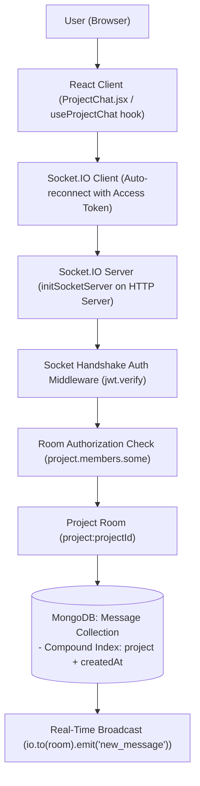
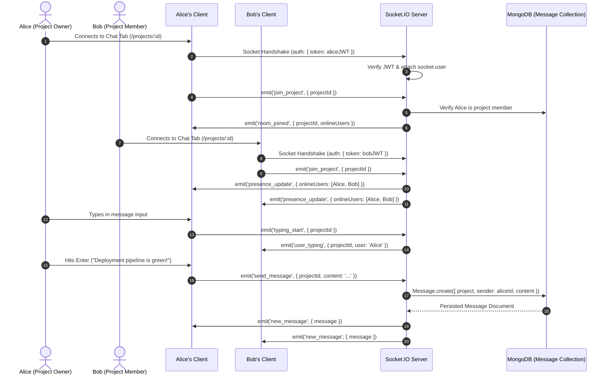
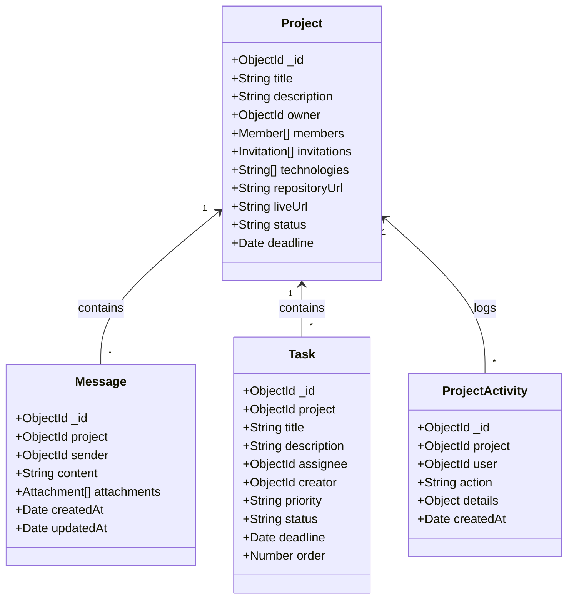

# CampusFlow Architecture Specification

## 1. System Overview

CampusFlow is designed using the **MERN** (MongoDB, Express, React, Node.js) technology stack, structured inside an **npm workspaces monorepo**. This ensures isolated package dependencies, shared tooling, and modular scalability without leaking domain concerns across layers.

---

## 2. Real-Time Chat & Socket.IO Architecture (Level 6)

---

## 3. REST vs WebSocket Responsibilities

| Responsibility Layer | Transport Protocol | Primary Role |
|---|---|---|
| **Message History & Archive** | **HTTP / REST** (`GET /api/projects/:id/messages`) | Initial chat history pagination, cache hydration via TanStack Query, fast cold-start rendering. |
| **Real-time Live Sync** | **WebSockets (Socket.IO)** | Instant message broadcasting, typing indicators ("Bob is typing..."), member presence/online status. |
| **Authentication** | **Handshake JWT** | Verify token during WebSocket connection setup; reject unauthenticated sockets immediately. |
| **Room Authorization** | **Socket Handshake & Room Guard** | Validate requester is an active member or owner of the target project before calling `socket.join('project:<id>')`. |
| **Persistence** | **MongoDB (`Message` collection)** | Every real-time message is validated and persisted to MongoDB *before* broadcasting to room members so history survives server restarts. |

---

## 4. Real-Time Chat Event Lifecycle

---

## 5. Data Models & Indexes

### Database Performance Indexes:
| Collection | Index Fields | Type | Purpose |
|---|---|---|---|
| `messages` | `{ project: 1, createdAt: 1 }` | Compound | Fast chronological chat history retrieval |
| `projects` | `{ "members.user": 1 }` | Multikey | Fast retrieval of user's active projects |
| `projects` | `{ "invitations.user": 1, "invitations.status": 1 }` | Compound | Fast pending invitations lookup |
| `tasks` | `{ project: 1, status: 1, order: 1 }` | Compound | Instant Kanban board column rendering |
| `projectactivities` | `{ project: 1, createdAt: -1 }` | Compound | Fast chronological activity feed pagination |
