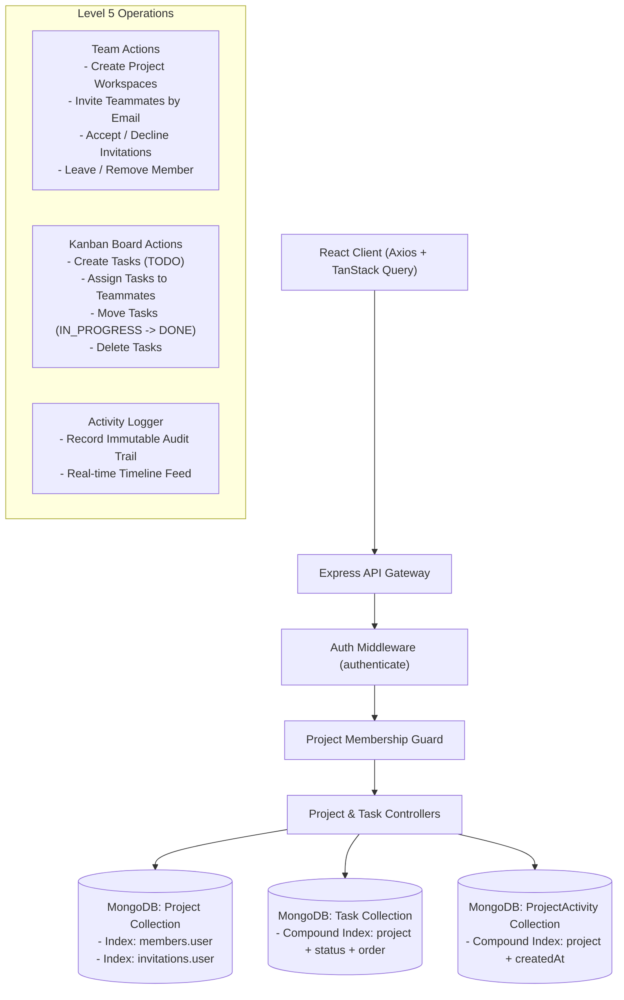
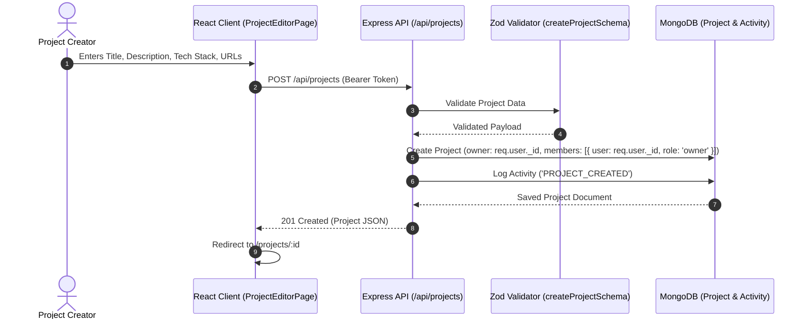
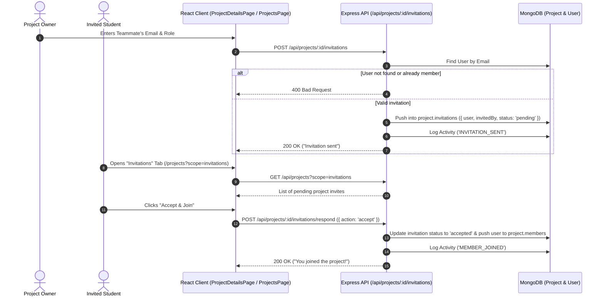
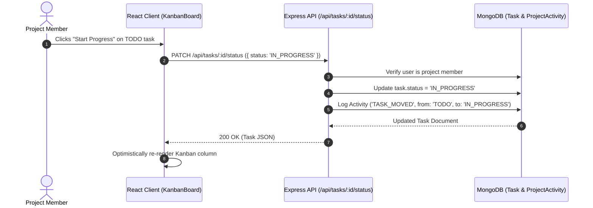
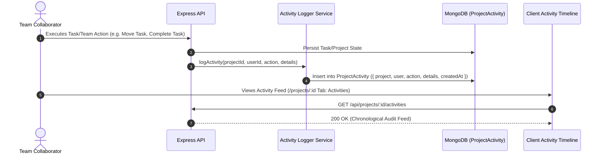
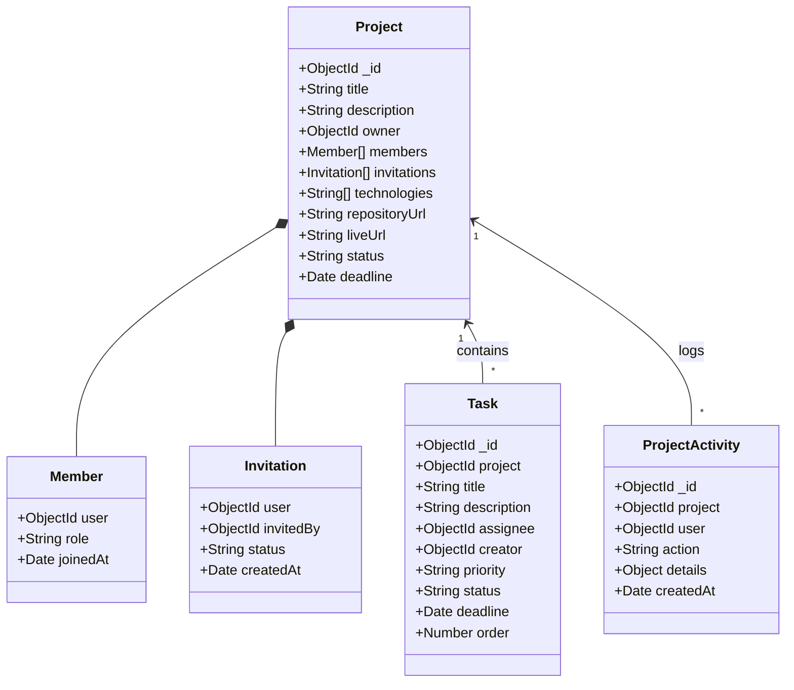

# CampusFlow Architecture Specification

## 1. System Overview

CampusFlow is designed using the **MERN** (MongoDB, Express, React, Node.js) technology stack, structured inside an **npm workspaces monorepo**. This ensures isolated package dependencies, shared tooling, and modular scalability without leaking domain concerns across layers.

---

## 2. Project Collaboration Architecture

---

## 3. Project Creation Flow

---

## 4. Team Invitation Flow

---

## 5. Kanban Task Lifecycle Flow

---

## 6. Activity Audit Logging Flow

---

## 7. Data Models & Indexes

### Database Performance Indexes:
| Collection | Index Fields | Type | Purpose |
|---|---|---|---|
| `projects` | `{ "members.user": 1 }` | Multikey | Fast retrieval of user's active projects |
| `projects` | `{ "invitations.user": 1, "invitations.status": 1 }` | Compound | Fast pending invitations lookup |
| `tasks` | `{ project: 1, status: 1, order: 1 }` | Compound | Instant Kanban board column rendering |
| `projectactivities` | `{ project: 1, createdAt: -1 }` | Compound | Fast chronological activity feed pagination |
