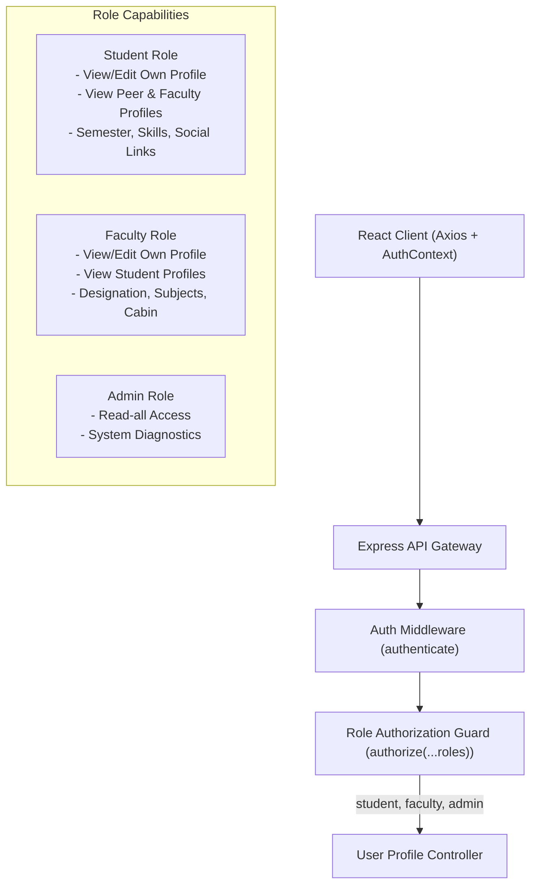
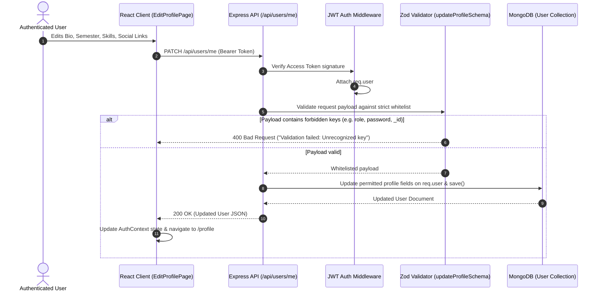
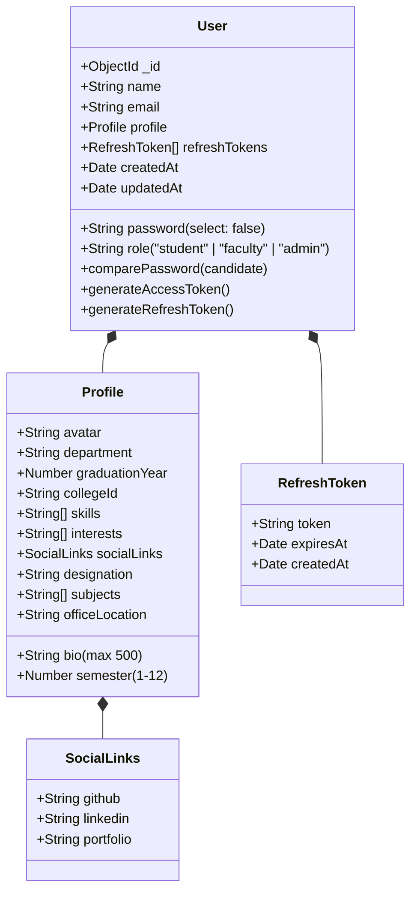

# CampusFlow Architecture Specification

## 1. System Overview

CampusFlow is designed using the **MERN** (MongoDB, Express, React, Node.js) technology stack, structured inside an **npm workspaces monorepo**. This ensures isolated package dependencies, shared tooling, and modular scalability without leaking domain concerns across layers.

---

## 2. Role-Based Access Control (RBAC) Architecture (Level 2)

---

## 3. User Profile Update & Whitelisting Permission Flow

---

## 4. User Data Model (Level 2 Extended)

---

## 5. Security & Isolation Matrix

| Capability / Action | Student | Faculty | Admin | Unauthenticated |
|---|---|---|---|---|
| View own profile (`GET /api/users/me`) | Allowed ✅ | Allowed ✅ | Allowed ✅ | Denied (401) ❌ |
| Edit own profile (`PATCH /api/users/me`) | Allowed ✅ | Allowed ✅ | Allowed ✅ | Denied (401) ❌ |
| View public profile (`GET /api/users/:id`) | Allowed ✅ | Allowed ✅ | Allowed ✅ | Denied (401) ❌ |
| Modify another user's profile | Denied (404/403) ❌ | Denied (404/403) ❌ | Denied (404/403) ❌ | Denied (401) ❌ |
| Change role via profile update | Denied (400) ❌ | Denied (400) ❌ | Denied (400) ❌ | Denied (401) ❌ |
| Change password via profile update | Denied (400) ❌ | Denied (400) ❌ | Denied (400) ❌ | Denied (401) ❌ |
