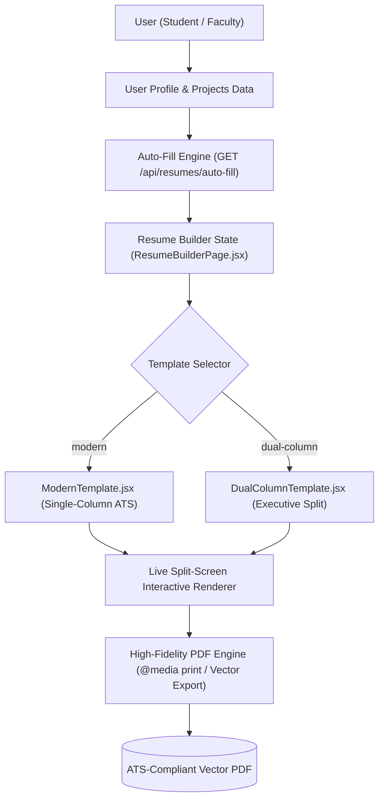
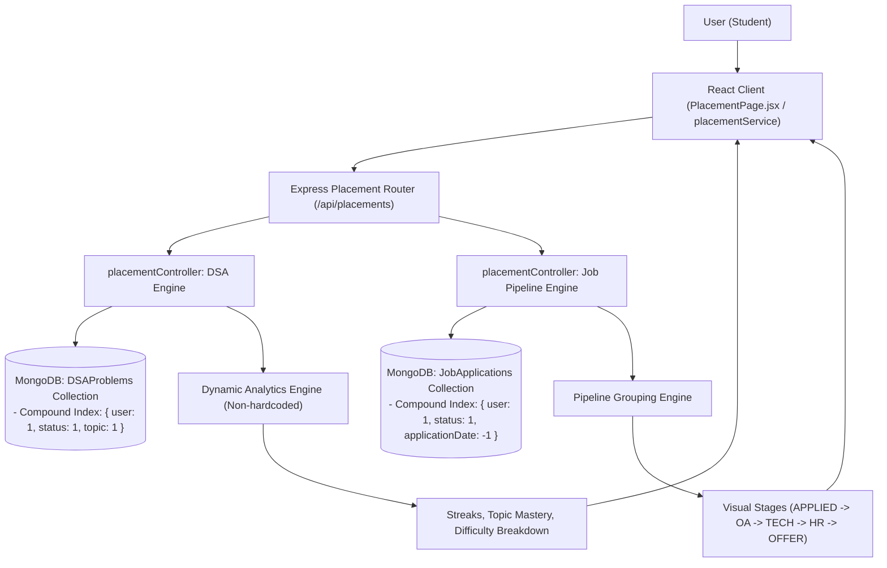
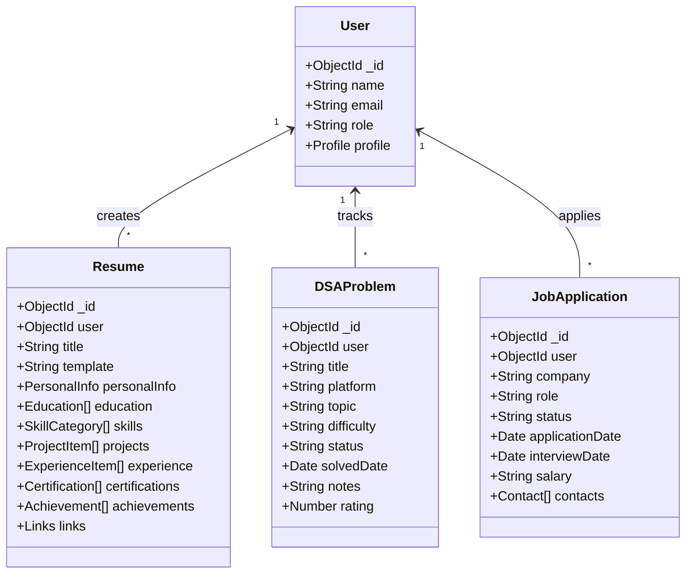
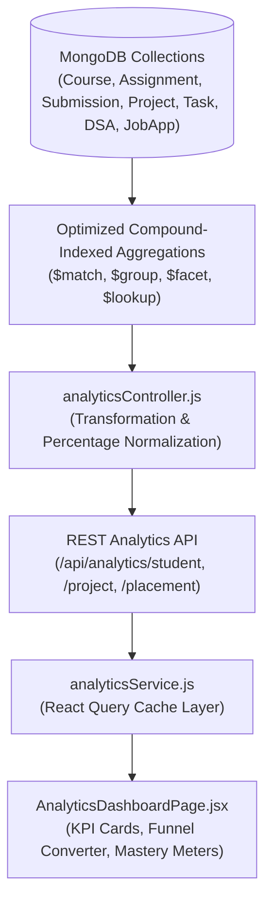
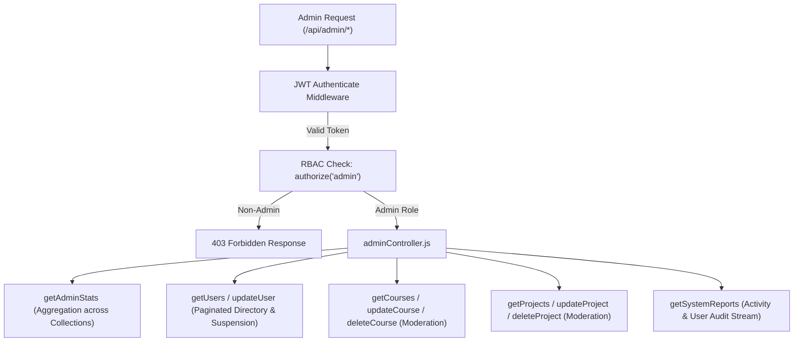
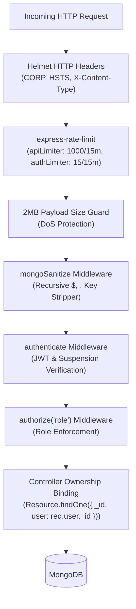

# CampusFlow Architecture Specification

## 1. System Overview

CampusFlow is designed using the **MERN** (MongoDB, Express, React, Node.js) technology stack, structured inside an **npm workspaces monorepo**. This ensures isolated package dependencies, shared tooling, and modular scalability without leaking domain concerns across layers.

---

## 2. Dynamic Resume Builder & PDF Generation Pipeline (Level 9)



---

## 3. Placement Preparation & Analytics Architecture (Level 8)



---

## 4. REST vs WebSocket Responsibilities

| Responsibility Layer | Transport Protocol | Primary Role |
|---|---|---|
| **Resume Management** | **HTTP / REST** (`/api/resumes`) | Resume creation, section editing, profile auto-fill extraction, and template preference persistence. |
| **Placement & Career Data** | **HTTP / REST** (`/api/placements/dsa`, `/jobs`) | Problem logging, dynamic algorithmic metrics aggregation, pipeline stage management. |
| **Notification Hydration & History** | **HTTP / REST** (`GET /api/notifications`) | Cold start state hydration, unread counts (`/unread-count`), pagination. |
| **Real-time Notifications** | **WebSockets (Socket.IO)** | Instant delivery of notifications directly to the targeted `user:<userId>` room. |
| **Real-time Chat** | **WebSockets (Socket.IO)** | Instant message broadcasting, typing indicators, and online presence in `project:<projectId>`. |
| **Authentication** | **Handshake JWT** | Verifies token during socket handshake; automatically joins socket to `user:<userId>`. |
| **Durability Guarantee** | **MongoDB Persistence** | All resumes, problems, applications, messages, and notifications are validated and persisted to MongoDB. |

---

## 5. Data Models & Performance Indexes



### Database Performance Indexes:
| Collection | Index Fields | Type | Purpose |
|---|---|---|---|
| `resumes` | `{ user: 1, createdAt: -1 }` | Compound | Fast user resume retrieval & sorting |
| `dsaproblems` | `{ user: 1, status: 1, topic: 1 }` | Compound | Fast topic mastery & difficulty filtering |
| `dsaproblems` | `{ user: 1, solvedDate: -1 }` | Compound | Fast daily/weekly streak calculation |
| `jobapplications` | `{ user: 1, status: 1, applicationDate: -1 }` | Compound | Instant visual pipeline stage rendering |
| `notifications` | `{ recipient: 1, read: 1, createdAt: -1 }` | Compound | Fast unread count aggregation & chronological queries |
| `messages` | `{ project: 1, createdAt: 1 }` | Compound | Fast chronological chat history retrieval |
| `projects` | `{ "members.user": 1 }` | Multikey | Fast retrieval of user's active projects |
| `tasks` | `{ project: 1, status: 1, order: 1 }` | Compound | Instant Kanban board column rendering |

---

## 10. Level 10: Data-Driven Analytics & Aggregation Engine

### Architecture Flow:


### Aggregation Pipeline Rationales:
1. **Academic Credits & Courses (`Course.aggregate`)**:
   - Uses `$match: { 'enrolledStudents.student': userId }` followed by `$facet` to compute total enrolled courses, total active credits, and department distribution in a single database roundtrip.
2. **Assignment Performance & Grades (`Submission.aggregate`)**:
   - Uses `$lookup` with the `assignments` collection to compute maximum total points against scored grades, calculating true dynamic completion rate % and average score % without fetching full submission histories into server memory.
3. **Project & Task Velocity (`Task.aggregate`)**:
   - Uses `$facet` to aggregate task counts by status (`DONE`, `IN_PROGRESS`, `TODO`) and group tasks by priority (`urgent`, `high`, `medium`, `low`) alongside individual member contributions.
4. **Placement Funnel & Career Pipeline (`JobApplication.aggregate` + `DSAProblem.aggregate`)**:
   - Groups applications by recruitment stages (`APPLIED` ➔ `OA` ➔ `TECHNICAL` ➔ `HR` ➔ `OFFER` / `REJECTED`) to dynamically calculate conversion and rejection rates alongside DSA difficulty and topic mastery progress.

---

## 11. Level 11: Administrative Layer & RBAC Governance Model

### Admin Subsystem Architecture:


### Security Guarantees:
- **Server-Side Enforcement**: All administrative endpoints are guarded by `authorize('admin')`. Unauthorized attempts by Student or Faculty roles are actively blocked with `403 Forbidden`.
- **Immediate Suspension Lockout**: When an administrator suspends a user (`isActive: false`), the `authenticate` middleware instantly blocks all subsequent API calls from that user's tokens, and `login` rejects new sign-in attempts.
- **Admin Self-Lockout Prevention**: The controller strictly forbids administrators from suspending or demoting their own user accounts.

---

## 12. Level 13: Defensive Security Architecture & Threat Mitigation

### Request Pipeline & Threat Interceptor:


### Threat Mitigation Specifications:
1. **NoSQL Query Operator Sanitization**: `sanitize.js` intercepts raw payloads and removes any keys matching `/^\$/` or containing `.` to prevent query operator injection.
2. **Brute Force & Rate Limiting**: `authLimiter` limits authentication attempts to 15 per 15 minutes, protecting against dictionary attacks.
3. **IDOR & Multi-Tenant Isolation**: Private resources (resumes, placements, submissions) are bound explicitly to `req.user._id` in database operations.
4. **Data Minimization**: User schema `toJSON` transform automatically strips sensitive attributes (`password`, `refreshToken`) on JSON serialization.

## 13. Level 16: Admin-Managed Must-to-Do DSA Sheet Architecture

### Architecture Overview:
```mermaid
graph TD
    Admin["Authorized Admin User"] -->|Creates / Curates / Reorders| DSASheet["DSASheet (Global Singleton: slug='must-to-do')"]
    Admin -->|Toggle Publish| PubState["isPublished: true | false"]
    
    DSASheet --> Questions["Global Questions Array\n(title, problemUrl, topic, difficulty, platform, order)"]
    
    PubState -->|When Published| AuthUsers["Authenticated CampusFlow Users\n(Students, Faculty, Admin)"]
    
    AuthUsers --> UserA["Student A"]
    AuthUsers --> UserB["Student B"]
    AuthUsers --> UserC["Student C"]
    
    UserA -->|Updates Progress| ProgA["DSASheetProgress (User A)\n- Two Sum: SOLVED\n- attemptedAt, solvedAt"]
    UserB -->|Updates Progress| ProgB["DSASheetProgress (User B)\n- Two Sum: ATTEMPTED\n- attemptedAt"]
    UserC -->|No Record (Default)| ProgC["Sparse Default: NOT_STARTED\n(0 DB records stored)"]
```

### Core Architecture Principles:
1. **Singleton Global Resource**:
   - The Must-to-Do DSA Sheet is a single, authoritative global resource managed exclusively by Admin users.
   - It is never duplicated per student.
2. **Strict Multi-User Progress Isolation**:
   - Shared question subdocuments contain zero user state (`isSolved`, `userStatus`, `solvedAt`).
   - Progress is maintained in `DSASheetProgress` with a unique compound index `{ user: 1, sheet: 1, questionId: 1 }`.
   - Modifying Student A's status has zero effect on Student B or the shared question document.
3. **Sparse Persistence Model**:
   - Questions default to `NOT_STARTED` without creating database records.
   - Only active attempts (`ATTEMPTED`) and completions (`SOLVED`) are persisted. Transitioning back to `NOT_STARTED` deletes the progress record to preserve database efficiency.
4. **Cascade Cleanup on Admin Question Deletion**:
   - When an administrator deletes a question from the sheet, `DSASheetProgress.deleteMany({ sheet: sheetId, questionId })` instantly removes all associated user progress records.
